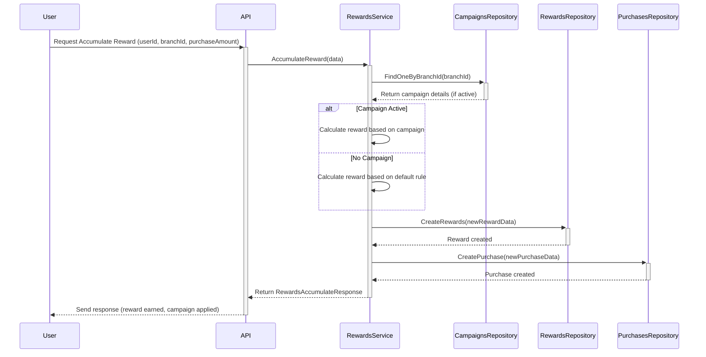

# loyalty-service

## Levantar server

1. Crear el archivo .env (colocar toas las envs que hay en el archivo **.env.example**)
2. Primero se debe levantar el environment
   - Aca corren migraciones y seeders si no hay nada en la DB (LA DB ya es una que esta en un cluster, se suminstrara la URI para observas los registros)
   ```sh
   ./start-environment.sh upb
   ```
   - Y para tumbar el ambiente ejecute
   ```sh
   ./start-environment.sh down
   ```

> **Importante**: Los seeders tendran fechas en las campañas viejas, esto para primero validar y ver que se realiza la validaicon de ACTIVACION de campaña
>
> Si se quiere ya realizar el proceso, hay que actualizar la campaña, con fechas actuales
>
> Ejemplo: Datos actuales (ir al cURL de actualización)
```sh
{
    "startDate": "2024-09-15",
    "endDate": "2024-09-30",
    "bonusType": "double",
    "bonusValue": 2.00
}
```

## Realizar peticiones en modo cURL

### Rewards
**Acumular puntos**

- ***POST*** **/api/rewards**
```sh
curl --location 'http://localhost:8888/api/rewards' \
--header 'Content-Type: application/json' \
--data '{
  "userId": "79f1ed5d-fb02-480f-8430-caabf42ce630",
  "branchId": "51968d08-9018-4a5c-94e6-9c7181359ef7",
  "purchaseAmount": 20000
}'
```

**Redimir puntos**
- ***POST*** **/api/rewards/redeem**
```sh
curl --location 'http://localhost:8888/api/rewards/redeem' \
--header 'Content-Type: application/json' \
--data '{
  "userId": "79f1ed5d-fb02-480f-8430-caabf42ce630",
  "branchId": "51968d08-9018-4a5c-94e6-9c7181359ef7",
  "rewardType": "points",
  "rewardValue": 10000
}'
```

### Camapaigns
#### Obtener campañas
- ***GET*** **/api/campaigns**
```sh
curl --location 'http://localhost:8888/api/campaigns'
```

Obtener las campañas de una sucursal
- ***GET*** **/api/campaigns?branchId={id}**
```sh
curl --location 'http://localhost:8888/api/campaigns?branchId=51968d08-9018-4a5c-94e6-9c7181359ef7'
```

#### Actualizar campaña
- ***PUT*** **/api/campaigns/:campaignId**
```sh
curl --location --request PUT 'http://localhost:8888/api/campaigns/bdbc9716-217b-427e-80d0-a1e5f09bd3c4' \
--header 'Content-Type: application/json' \
--data '{
    "startDate": "2024-09-15",
    "endDate": "2024-09-30",
    "bonusType": "double",
    "bonusValue": 2.00
}'
```


## Unit Testing
- Para correr las pruebas unitarias solo se debe ejecutar 
```sh
make test
```

Esto correra los test, y la covertura y generara una ruta local para ver las coverturas

## Postman
Aca se encuentran los endpoints de loyalty

[Postman](https://www.postman.com/interstellar-desert-612344/workspace/publicv2/collection/28382910-60d64557-1816-4328-9ea2-96fac161341b?action=share&creator=28382910)

## Technologies and tools

- Framework: [go-zero](https://go-zero.dev/en/docs/tasks)
- DB: [Postgres](https://www.postgresql.org/)
- ORM: [Gorm](https://gorm.io/) 
- Docker
- SH
- Makefile
- Github-Actions

## Swagger

## Diagramas
### Acumulación de Recompensas - Diagrama de Secuencia


